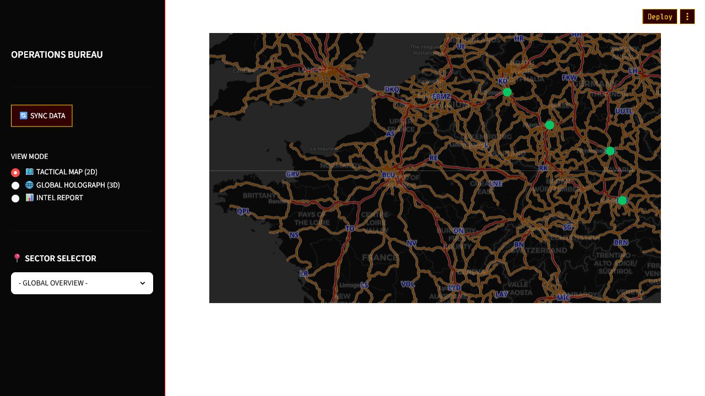

# Manul Team - RailBoard

RailBoard is a public-transport decision-support prototype built for the first TUM Campus Heilbronn hackathon. It combines static GTFS schedule data, RDF knowledge graphs, graph algorithms, and live departure information into a Streamlit dashboard for exploring rail-network reliability.



The screenshot above was captured from the local Streamlit real-time monitoring page running on `localhost`.

## Highlights

- Converts GTFS stops and connections into an RDFLib knowledge graph with local SPARQL queries.
- Builds a NetworkX graph from stop-to-stop edges for route planning and network analysis.
- Computes PageRank-style hub importance and risk scores for reliability-aware routing.
- Compares fastest routes with robust alternatives that trade travel time against hub risk.
- Visualizes stops, route legs, and rail connections with PyDeck and Folium.
- Includes a real-time DB delay monitor using the `db.transport.rest` API, local caching, and station-level delay summaries.

## Tech Stack

- Python
- Streamlit
- RDFLib and SPARQL
- NetworkX
- pandas and NumPy
- PyDeck, Folium, streamlit-folium
- FastAPI for the optional API server

## Repository Structure

```text
app.py                    Main Streamlit dashboard
api_server.py             Optional FastAPI service for stops, edges, and routes
pages/urban_pulse.py      Real-time delay monitoring page
src/gtfs_loader.py        GTFS ZIP parsing utilities
src/kg_builder.py         RDF knowledge-graph construction
src/kg_to_graph.py        RDF-to-NetworkX conversion
src/ranking.py            PageRank and normalized risk scoring
src/routing.py            Fastest and robust route algorithms
src/realtime/             Live transport API client and real-time visualization
```

## Quick Start

```powershell
py -3.11 -m venv .venv
.\.venv\Scripts\Activate.ps1
python -m pip install -U pip
pip install -r requirements.txt
streamlit run app.py
```

The main dashboard expects a GTFS ZIP file at:

```text
data/gtfs/default_gtfs.zip
```

The app caches generated graph, edge, and PageRank artifacts under `data/cache/` so repeated runs do not need to rebuild the full graph.

## Optional API Server

```powershell
uvicorn api_server:app --reload
```

Available endpoints include:

- `GET /health`
- `GET /api/stops`
- `GET /api/edges`
- `GET /api/route?src=<station>&dst=<station>`

## Why It Matters

The project is more than a map demo: it models transportation data as a queryable graph, ranks critical hubs, and exposes route choices that can account for both travel time and operational risk.
